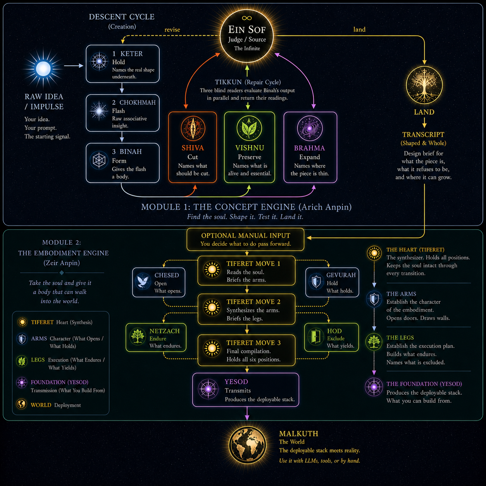

# The Tzimtzum Creation Engine

**A multi-agent creation engine built on the principle that the pause before speaking is more important than the speech.**

---

The Tzimtzum Engine is a framework for turning vague impulses into deployable artifacts. It runs on [Claude Code](https://docs.anthropic.com/en/docs/claude-code) using subagent invocation — no API keys required, just a Claude Pro or Max subscription and session authentication.

The engine operates in two modules that mirror the Kabbalistic structure of creation: a concept phase that discovers the soul of an idea, and an embodiment phase that gives that soul a body ready for the world.



---

## Module 1: The Concept Engine (Arich Anpin)

**The Upper Face.** Seven agents operating in the realm of pure intellect.

This engine takes a raw prompt and discovers its true shape, character, and soul. It focuses on wholeness over perfection. Three agents descend to create (Keter → Chokhmah → Binah), three agents read the output to evaluate (Shiva, Vishnu, Brahma), and one arbiter (Ein Sof) judges whether the piece is whole or needs revision.

**Key architectural principles:**
- A non-generative receptive agent as the first stage — replacing planning with recognition
- Information-diet-as-constraint — selective input withholding prevents agents from collapsing into each other's roles
- Dual-nature critique agents — each evaluator is grounded in the cognitive posture of the agent it reads, making every critique richer and more specific

**Call budget:** 7 per cycle, max 3 cycles. Up to 24 calls per run.

→ [Full documentation](concept-engine/README.md)

---

## Module 2: The Embodiment Engine (Zeir Anpin)

**The Lower Face.** Six agents plus a transmission layer, operating in the realm of embodiment.

This engine takes the completed concept from Module 1 and prepares it for reality. Using parallel blind pairs with emotional and tactical constraints, it solidifies the soul into a deployable stack (code, prose, or prompts) ready for human interaction.

The engine fires in two rounds — arms first (Chesed/Gevurah: character), then legs (Netzach/Hod: manifestation) — with Tiferet at the center holding all positions and ensuring the soul survives the transition from concept to production. Yesod compiles the final output into a buildable stack.

**Key architectural principles:**
- Blind-pair architecture — each pair of agents works independently, never seeing each other's output, producing genuine tension instead of pre-averaged consensus
- Soul-keeping — Tiferet anchors every synthesis against the upper engine's bones, overruling any pillar whose adjustment makes the concept less itself
- Via negativa constraints — agents are defined as much by what they cannot do as by their instructions

**Call budget:** 8 calls per run. Fixed — no revision loops.

→ [Full documentation](embodiment-engine/README.md)

---

## The Full Pipeline

When both modules run in sequence, the engine performs a complete descent from impulse to deployable artifact:

```
Module 1: The Concept Engine (Arich Anpin)
  Input → Keter (hold) → Chokhmah (flash) → Binah (form)
        → Shiva (cut) + Vishnu (preserve) + Brahma (expand)
        → Ein Sof (judge: whole or revise)

Module 2: The Embodiment Engine (Zeir Anpin)
  Transcript → Tiferet Move 1 (brief the arms)
             → Chesed (open) + Gevurah (constrain)
             → Tiferet Move 2 (synthesize, brief the legs)
             → Netzach (endure) + Hod (exclude)
             → Tiferet Move 3 (final compilation)
             → Yesod (compile to deployable stack)
```

Maximum 32 calls for the full pipeline (24 + 8) — the 32 paths of wisdom.

The modules are designed to work independently. You can run Module 1 alone for concept work, or feed your own concept into Module 2 for embodiment. The handoff is a transcript file.

---

## Key Findings

These findings emerged from calibration and testing. They generalize beyond this engine to any multi-agent system.

### Tzimtzum at the data level
When the second agent (Chokhmah) received the original input alongside the first agent's (Keter's) contracted shape, it drifted into composing drafts instead of producing raw fragments — effectively doing the third agent's (Binah's) job. Withholding the original input forced genuine role differentiation. **Information diet determines cognitive posture.** In any multi-agent pipeline where agents share the same underlying model, structural input constraints are more reliable than behavioral instructions for maintaining role separation.

### Dual-nature technique
A critique agent prompted as "Agent 4: please cut excess" produces generic criticism. The same agent prompted as "You are Keter who became Shiva — the one who held the question now dissolves what no longer serves it" produces precise, contextual critique. The name activates the model's existing knowledge of sacred destruction, transformation, and dissolution, reinforcing the behavioral instructions. **The theological grounding has a direct engineering payoff** — richer readings mean fewer revision cycles.

### Blind-pair tension
When parallel agents can see each other's output, they converge toward consensus before the synthesis agent receives them. When they work blind, they genuinely disagree — and the disagreement is the value. In testing, blind pairs consistently produced more specific, actionable output than agents that could see each other's work.

### Soul-keeping through embodiment
The primary failure mode in concept-to-production pipelines is not technical — it is drift. Each practical adjustment is individually reasonable, but their cumulative effect erodes the original insight. The engine addresses this structurally: Tiferet checks every pillar adjustment against the original concept's bones. The question is never "has this changed?" but "is this more itself or less itself?"

### Contradiction resolution modes
When blind pairs disagree, the synthesis agent (Tiferet) resolves contradictions through one of three modes:
1. **Transform** — find a third register where both positions are true (apparent contradiction)
2. **Side with soul** — choose the voice closer to the original concept, address the other's concern elsewhere (real contradiction)
3. **Hold both** — recognize that the positions already agree under the surface language (false contradiction)

### Restriction is easier than expansion (for LLMs)
Via negativa instructions ("do not do X") are unambiguous and enforceable. Expansive instructions ("be generously beautiful") are vague and interpretable. In multi-agent systems where some agents restrict and others expand, the restrictive agents get more leverage not because their prompts are stronger, but because the model can execute restriction more precisely than expansion. This was observed in the Embodiment Engine: the Left Pillar agents (Gevurah/Hod) consistently produced sharper, more specific output than the Right Pillar agents (Chesed/Netzach), leading the synthesis agent to weight their contributions more heavily. **An open question:** in early testing, this bias may partly reflect the input — a concept whose soul was already about restraint will naturally produce austere output. More test runs across different input types are needed to separate engine bias from input properties.

### Hard-cap hit and medium mismatch
In most runs, Ein Sof lands the piece as "whole" in a single tikkun cycle. In one run ([full transcript](concept-engine/examples/hard_cap_run_calendar.md)), Ein Sof triggered revision for all three cycles and hit the hard cap without landing. Analysis of the transcript reveals a consistent pattern across all three cycles: Binah produces increasingly refined philosophical prose, each cycle more embodied and beautiful than the last — but Brahma correctly notes in every cycle that the reader still "cannot see the thing." The concept engine is optimized for finding the *soul* of an idea, not producing visual specifications. When the input asks for a design, the engine keeps deepening the *writing* without answering the *design question*. **This is not a failure — it is the engine correctly signaling that the concept is ready for the Embodiment Engine.** The hard cap functions as intended: it prevents infinite loops and produces a transcript that, while not "whole" by Ein Sof's standard, contains genuinely rich material for Module 2 to embody.

---

## How It Runs

**Prerequisites:**
- A Claude Pro or Max subscription
- [Claude Code](https://docs.anthropic.com/en/docs/claude-code) — desktop app or CLI

**Getting started:**
1. Clone this repo
2. Open the module folder you want in Claude Code (e.g., `concept-engine/` or `embodiment-engine/`)
3. Type your input. The orchestrator (`CLAUDE.md`) handles routing.

```bash
git clone https://github.com/keninhio/tzimtzum-engine.git

# For concept work only:
cd tzimtzum-engine/concept-engine
claude

# For embodiment (feed it a completed transcript):
cd tzimtzum-engine/embodiment-engine
claude
```

**Model assignments:**
- Module 1: Orchestrator on Sonnet, subagents on Opus (Keter, Chokhmah, Binah, Ein Sof) and Sonnet (Shiva, Vishnu, Brahma)
- Module 2: Orchestrator on Sonnet, Tiferet on Opus, all other subagents on Sonnet

---

## Why Theology, Not Just Labels

The names are not decorative. They are functional at three levels:

**The frameworks gave the architecture.** The Kabbalistic concept of tzimtzum (divine self-contraction) directly became the information-diet constraint — withholding input to create room for genuine emergence. The sefirotic emanation structure gave the sequential descent its shape. The Hindu trimurti gave the tikkun cycle its three reading postures. These aren't metaphors applied after the fact — the engineering decisions came from the theology.

**The names activate the model's existing knowledge.** LLMs are trained on corpora that include religious texts, mythology, and philosophy. When an agent reads "You are Shiva, the dissolver" — the name activates a network of associations that reinforce the behavioral instructions. A role named "Shiva" arrives semantically aligned with its function in a way that "Agent 4: Cutter" does not.

**The design philosophy is via negativa.** Ancient apophatic traditions define something most precisely by what it is not. Every distinctive feature of this engine is a subtraction. Keter's job is to not answer. Chokhmah cannot see the original input. Tikkun agents cannot edit. Pillars cannot see each other. The engine was designed not by adding capabilities, but by deliberately removing them.

---

## Repository Structure

```
tzimtzum-engine/
├── README.md                              ← you are here
├── LICENSE
│
├── concept-engine/                        ← Module 1: The Concept Engine (Arich Anpin)
│   ├── CLAUDE.md                          ← orchestrator
│   ├── README.md                          ← full documentation
│   ├── arich_anpin_spec.md                ← architecture spec
│   └── .claude/agents/                    ← 7 agents
│       ├── keter.md                       # descent: the pause
│       ├── chokhmah.md                    # descent: the flash
│       ├── binah.md                       # descent: the form
│       ├── shiva.md                       # tikkun: the cut
│       ├── vishnu.md                      # tikkun: the preserve
│       ├── brahma.md                      # tikkun: the expand
│       └── ein_sof.md                     # judgment: the whole
│   └── examples/
│       └── hard_cap_run_calendar.md       ← example: 3-cycle run that hit hard cap
│
└── embodiment-engine/                     ← Module 2: The Embodiment Engine (Zeir Anpin)
    ├── CLAUDE.md                          ← orchestrator
    ├── README.md                          ← full documentation
    ├── zeir_anpin_spec.md                 ← architecture spec
    ├── .claude/agents/                    ← 6 agents
    │   ├── tiferet.md                     # the heart: soul-keeper
    │   ├── chesed.md                      # right arm: what opens
    │   ├── gevurah.md                     # left arm: what holds
    │   ├── netzach.md                     # right leg: what endures
    │   ├── hod.md                         # left leg: what yields
    │   └── yesod.md                       # foundation: transmission
    └── examples/
        └── calendar-app/yesod_stack/      ← example deployable output
```

---

## License

[MIT](LICENSE)
